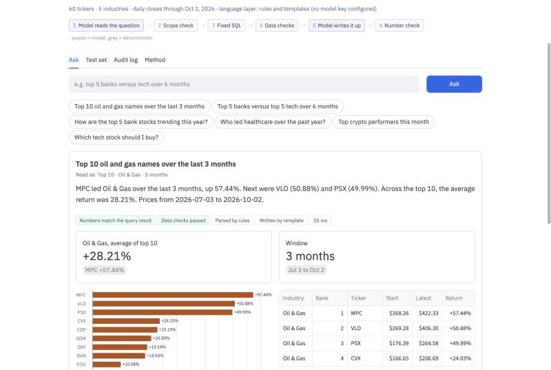

# Portfolio Q&A

Ask a plain-English question about industry performance and get a short write-up, a table, a chart
and a record of how the answer was produced.



The rule I built around: **the model never does the math.** It turns the question into a small query
plan and writes up the result. A fixed SQL template does every calculation, and every number in the
write-up is checked against the query result before it's shown.

```
question
   │
   ▼
1. Model reads the question ──► query plan from a closed schema
   │                             (intent, industries, top N, window)
   ▼
2. Scope check ───────────────► forecasts, advice, unknown industries: refused, no query run
   │
   ▼
3. Fixed SQL template ────────► returns per ticker, bound parameters, no generated SQL
   │
   ▼
4. Data checks ───────────────► missing prices, incomplete window, stale or invalid prices
   │
   ▼
5. Model writes it up ────────► from the checked facts only
   │
   ▼
6. Number check ──────────────► any number not in the result: draft replaced by a template
   │
   ▼
answer + table + chart + audit record
```

## Running it

```bash
python -m venv .venv && source .venv/bin/activate
pip install -r requirements.txt
streamlit run app.py
python evaluate.py        # 21 questions with known answers
```

It works without a model key: a keyword parser and a template writer take the model's place, and every
check still runs. Two optional settings, read from environment variables or `.streamlit/secrets.toml`
(see `secrets.toml.example`):

| Setting | Effect |
|---|---|
| `ANTHROPIC_API_KEY` | Uses Claude to read questions and write answers. Stays on the server. |
| `APP_PASSWORD` | Asks visitors for a password before showing the app. |

`ANTHROPIC_MODEL` picks the model (default `claude-opus-5-5`).

## Things to try

| Question | What it shows |
|---|---|
| Top 10 oil and gas names over the last 3 months | Ranking with chart and checked write-up |
| Top 5 banks versus top 5 tech over 6 months | Two industries side by side |
| How are the top 5 bank stocks trending this year? | Price trend, and the data check catching BK |
| How did EV makers do over the last 6 months? | Synonyms ("EV makers" means Automobiles) |
| Top banks over the last 2 years | Refused: window not in the data |
| Which tech stock should I buy? | Refused: investment advice |

Each answer has a "How this answer was produced" section with the plan, the SQL and its parameters,
the data checks and the number check, plus suggested follow-up questions.

## Tabs

- **Ask**: questions and answers, newest first
- **Test set**: runs the 21 test questions in the browser. Each is checked for the right plan, for math
  that matches a separate pandas calculation, and for numbers that all appear in the result.
- **Audit log**: the session's requests with parser, writer, timing and a hash of the result set
- **Method**: the design and what I'd change for production

## Files

| File | Purpose |
|---|---|
| `engine.py` | Plan validation, SQL template, data checks, ranking. The only place numbers are produced. |
| `llm.py` | Question parsing, write-up, number check, and the fallbacks used without a model. |
| `pipeline.py` | Runs the flow and appends each request to `audit_log.jsonl`. |
| `app.py` | Streamlit interface and the optional password gate. |
| `evaluate.py` | The test set. |
| `fetch_data.py` | Refreshes the sample data (needs `pip install yfinance`). |

## For production I would

- Call the model through the firm's LLM gateway rather than a public API
- Enforce each user's data entitlements in the SQL layer
- Keep metric definitions in a governed semantic layer shared with reporting
- Send failed-check or low-confidence answers to a reviewer
- Track refusal rate, fallback rate, latency and cost per answered question

## Data

One year of public daily closes from Yahoo Finance for 60 tickers in 5 industries, to 2 October 2026.
BK is in the reference list with no prices on purpose, so the missing-data check has something real
to catch.
